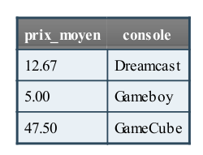

# PHP pour les nuls

## function sur les tableau

- `array_chunk($tableau,$tailleAdiviser)`: est une fonction qui permet de diviser un tableau en morceau d'autre tableau, les morceau à avoir sont spécifier par le deuxième argument
- `array_pop(&$array)` : supprime le dernier element d'un tableau, exemple :`array_pop($tab)`
- `array_shift(&$array)`: supprime le premier element d'un tableau, exemple :`array_shift($tab)`
- `array_push(&$array)`: ajoute un ou plusieurs element à la fin d'un tableau, exemple: `array_push($tab, ...$newUsers);` ou `array_push($tab,"newElement");` `array_push($tab,453);`,...
- `array_unshift(&$array)`: ajoute un ou plusieurs element au début d'un tableau,exemple exemple: `array_unshift($tab, ...$newUsers);` ou `array_unshift($tab,"newElement");` `array_unshift($tab,453);`,...

## Les operateurs

L'operateur combiner:

```{PHP}
$a = 58;
$b = 17;
echo $a < = > $b;
```

Astuces memotechnique `$a < == > $b`:

- Le premier symbole c'est `"<"` donc `"$a<$b"` alors on aura -1,
- Le deuxième symbole c'est `"="` donc `"$a = $b"` alors on aura 0
- Le troisième symbole c'est `">"` donc `"$a > $b"` alors on aura 1

## Database

### Les fonctions SQL

Les fonctions SQL peuvent être classées en deux catégories :

- **les fonctions scalaires** : elles agissent sur chaque entrée. Par exemple, vous pouvez transformer en majuscules la valeur, exemple:
  - `UPPER()`:convertir en majuscules,
  - `LOWER()`: convertir en minuscules,
  - `LENGTH()`: compter le nombre de caractères
  - `ROUND`: arrondir un nombre décimal
  `SELECT UPPER(nom) as nom FROM jeux_video`
de chacune des entrées d'un champ ;
- **les fonctions d'agrégat** : lorsque vous utilisez ce type de fonctions, des calculs sont faits sur l'ensemble de la table pour
retourner une valeur. Par exemple, calculer la moyenne des prix retourne une valeur : le prix moyen, par exemple on:
  - `AVG()`: calculer la moyenne
  - `SUM` : additionner les valeurs
  - `MAX` : retourner la valeur maximale
  - `MIN` : retourner la valeur minimale
  - `COUNT` : compter le nombre d'entrées
  `SELECT COUNT(*) AS nbjeux FROM jeux_video`, `SELECT MAX(prix) AS prix_max FROM jeux_video`

#### GROUP BY et HAVING : le groupement de données

On ne pouvait pas récupérer d'autres champs lorsqu'on utilisait une fonction d'agrégat. Prenons
par exemple la requête suivante :
`SELECT AVG(prix) AS prix_moyen, console FROM jeux_video` mais on peut faire cela en groupant les données

- `GROUP BY` : grouper des données: Ce qui pourrait avoir du sens par exemple ce serait de demander le prix moyen des jeux pour chaque console ! Pour faire cela,
on doit utiliser un nouveau mot-clé : `GROUP BY`. Cela signifie « grouper par ». On utilise cette clause en combinaison d'une fonction d'agrégat (comme AVG) pour obtenir des informations intéressantes sur des groupes de données.

`SELECT AVG(prix) AS prix_moyen, console FROM jeux_video GROUP BY console` : Il faut utiliser GROUP BY en même temps qu'une fonction d'agrégat, sinon il ne sert à rien.
;

- `HAVING` : filtrer les données regroupées: `HAVING` est un peu l'équivalent de `WHERE`, mais il agit sur les données une fois qu'elles ont été regroupées. C'est donc une façon de filtrer les données à la fin des opérations.
`SELECT AVG(prix) AS prix_moyen, console FROM jeux_video GROUP BY console HAVING prix_moyen <= 10`: HAVING ne doit s'utiliser que sur le résultat d'une fonction d'agrégat. Voilà pourquoi on l'utilise ici sur prix_moyen et non sur
console.
*Je ne comprends pas la différence entre WHERE et HAVING. Les deux permettent de filtrer, non ?*

Oui, mais pas au même moment. WHERE agit en premier, avant le groupement des données, tandis que HAVING agit en second, après le groupement des données. On peut d'ailleurs très bien combiner les deux, regardez l'exemple suivant : `SELECT AVG(prix) AS prix_moyen, console FROM jeux_video WHERE possesseur='Patrick' GROUP BY console HAVING prix_moyen <= 10`

#### Les dates

- **Utilisation des champs de date en SQL**: Vous pouvez utiliser d'autres opérateurs que
le signe égal pour obtenir les données entre deux dates, par exemple: `SELECT pseudo, message, date FROM minichat WHERE date >= '2010-04-02 15:28:22'` ou `SELECT pseudo, message, date FROM minichat WHERE date >= '2010-04-02 00:00:00' AND date <= '2010-04-18 00:00:00'`

En `SQL`, pour récupérer des données comprises entre deux intervalles, comme ici, il y a une syntaxe plus simple et plus légante avec le mot-clé `BETWEEN` qui signifie « entre ». On pourrait écrire la requête précédente comme ceci :
`SELECT pseudo, message, date FROM minichat WHERE date BETWEEN '2010-04-02 00:00:00' AND '2010-04-18 00:00:00'`
Cela signifie : « récupérer tous les messages dont la date est comprise entre 2010-04-02 00:00:00 et 2010-04-18 00:00:00 ».
Vous pouvez aussi utiliser cette syntaxe sur les champs contenant des nombres.

- **Les fonctions de gestion des dates**:
  - `NOW()` : obtenir la date et l'heure actuelles :`INSERT INTO minichat(pseudo, message, date) VALUES('Mateo', 'Message', NOW())`.
  - `DAY()`, `MONTH()`, `YEAR()` : extraire le jour, le mois ou l'année
  - `HOUR()`, `MINUTE()`, `SECOND()` : extraire les heures, minutes, secondes
  Par exemple: `SELECT pseudo, message, DAY(date) AS jour, MONTH(date) AS mois, YEAR(date) AS annee, HOUR(date) AS heure, MINUTE(date) AS minute, SECOND(date) AS seconde FROM minichat`
  - `DATE_FORMAT` : formater une date, `SELECT pseudo, message, DATE_FORMAT(date, '%d/%m/%Y %Hh%imin%ss') AS date FROM minichat`: Les symboles `%d`, `%m`, `%Y` (etc.) sont remplacés par le jour, le mois, l'année, etc.
  - `DATE_ADD` et `DATE_SUB` : ajouter ou soustraire des dates, Il est possible d'ajouter ou de soustraire des heures, minutes, secondes, jours, mois ou années à une date. Il faut envoyer deux
paramètres à la fonction : la date sur laquelle travailler et le nombre à ajouter ainsi que son type.
exemple : `SELECT pseudo, message, DATE_ADD(date, INTERVAL 15 DAY) AS date_expiration FROM minichat`

#### Les jointures entre tables

Un des principaux intérêts d'une base de données est de pouvoir créer des relations entre les tables, de pouvoir les lier entre elles.

Il existe plusieurs types de jointures, qui nous permettent de choisir exactement les données que l'on veut récupérer.
Je vous propose d'en découvrir deux, les plus importantes :

- **les jointures internes** : elles ne sélectionnent que les données qui ont une correspondance entre les deux tables ;
- **les jointures externes** : elles sélectionnent toutes les données, même si certaines n'ont pas de correspondance dans l'autre table.
  
##### Les jointures internes

Une jointure interne peut être effectuée de deux façons différentes :

- à l'aide du mot-clé `WHERE` : c'est l'ancienne syntaxe, toujours utilisée aujourd'hui, qu'il faut donc connaître mais que vous devriez éviter d'utiliser si vous avez le choix ;
- à l'aide du mot-clé `JOIN` : c'est la nouvelle syntaxe qu'il est recommandé d'utiliser. Elle est plus efficace et plus lisible.

1. Jointure interne avec WHERE (ancienne syntaxe)
Pour réaliser ce type de jointure, on va sélectionner des champs des deux tables et indiquer le nom de ces deux tables dans la
clause FROM :
`SELECT jeux_video.nom, proprietaires.prenom FROM proprietaires, jeux_video WHERE jeux_video.ID_proprietaire = proprietaires.ID`
2. Jointure interne avec JOIN (nouvelle syntaxe)
Bien qu'il soit possible de faire une jointure interne avec un WHERE comme on vient de le voir, c'est une ancienne syntaxe et
aujourd'hui on recommande plutôt d'utiliser JOIN. Il faut dire que nous étions habitués à utiliser le WHERE pour filtrer les
données, alors que nous l'utilisons ici pour associer des tables et récupérer plus de données.
Pour rappel, voici la requête qu'on utilisait avec un WHERE :
`SELECT j.nom nom_jeu, p.prenom prenom_proprietaire FROM proprietaires p, jeux_video j WHERE j.ID_proprietaire = p.ID`
Avec un JOIN, on écrirait cette même requête de la façon suivante :
`SELECT j.nom nom_jeu, p.prenom prenom_proprietaire FROM proprietaires p INNER JOIN jeux_video j ON j.ID_proprietaire = p.ID`

##### Les jointures externes

Les jointures externes permettent de récupérer toutes les données, même celles qui n'ont pas de correspondance.
Cette fois, la seule syntaxe disponible est à base de JOIN. Il y a deux écritures à connaître : LEFT JOIN et RIGHT JOIN. Cela revient pratiquement au même, avec une subtile différence que nous allons voir.

- LEFT JOIN : récupérer toute la table de gauche
Reprenons la jointure à base de INNER JOIN et remplaçons tout simplement INNER par LEFT :

```{SQL}
SELECT j.nom nom_jeu, p.prenom prenom_proprietaire
FROM proprietaires p
LEFT JOIN jeux_video j
ON j.ID_proprietaire = p.ID
```

proprietaires est appelée la « table de gauche » et jeux_video la « table de droite ». Le LEFT JOIN demande à
récupérer tout le contenu de la table de gauche, donc tous les propriétaires, même si ces derniers n'ont pas d'équivalence dans la
table jeux_video.

- RIGHT JOIN : récupérer toute la table de droite: Le RIGHT JOIN demande à récupérer toutes les données de la table dite « de droite », même si celle-ci n'a pas d'équivalent
dans l'autre table. Prenons la requête suivante :

```{SQL}
SELECT j.nom nom_jeu, p.prenom prenom_proprietaire
FROM proprietaires p
RIGHT JOIN jeux_video j
ON j.ID_proprietaire = p.ID
```

La table de droite est « jeux_video ». On récupèrerait donc tous les jeux, même ceux qui n'ont pas de propriétaire associé.

Il y a deux cas possibles :

- soit le champ ID_proprietaire contient une valeur qui n'a pas d'équivalent dans la table des propriétaires, par exemple « 56 » ;
- soit le champ ID_proprietaire vaut `NULL`, c'est-à-dire que personne ne possède ce jeu. C'est le cas notamment du jeu Bomberman dans la table que vous avez téléchargée (voir tableau suivant).

## Les expressions regulières

Dans les expressions regulière on dispose des `POSIX` et de `PCRE`, le `POSIX` est beaucoup plus mis en avant par `PHP` mais il est moins performant et moins rapide que le `PCRE`.

### Le regex de type PCRE

Nous avons donc choisi `PCRE`. Il existe plusieurs fonctions utilisant le « langage PCRE » et qui commencent toutes par `preg_` :

- `preg_grep` :
- `preg_split` :
- `preg_quote` :
- `preg_match` :
- `preg_match_all` :
- `preg_replace` :
- `preg_replace_callback`:
Chaque fonction a sa particularité : certaines permettent de faire simplement une recherche, d'autres une recherche et un remplacement, mais leur gros point commun c'est qu'elles utilisent un « langage » identique pour effectuer une recherche.
Lorsque vous aurez appris le langage `PCRE`, vous pourrez utiliser chacune d'elles sans problème.

Première chose importante à savoir : une regex (Expression régulière) est toujours entourée de caractères spéciaux appelés
délimiteurs.
En `PHP` on peut choisir n'importe quel caractère spécial comme délimiteur, et pour éviter de tourner en rond trop longtemps, je vais vous en imposer un : le dièse `#`!
Prenons un exemple : vous aimeriez savoir si une variable contient le mot « guitare ». Il vous suffit d'utiliser la regex suivante
pour faire la recherche :

```{PHP}
<?php
if (preg_match("#guitare#", "J'aime jouer de la guitare."))
{
  echo 'VRAI';
}else {
    echo 'FAUX';
}
?>
```

### Des regex… avec MySQL

MySQL comprend les regex !
Il faut savoir cependant que MySQL ne comprend que les regex en langage POSIX, et pas PCRE comme on a appris.
Vous avez juste besoin de retenir ce qui suit pour faire une regex POSIX :

- il n'y a pas de délimiteur ni d'options. Votre regex n'est donc pas entourée de dièses ;
- il n'y a pas de classes abrégées comme on l'a vu plus haut, donc pas de \d, etc. En revanche, vous pouvez toujours
utiliser le point pour dire : « n'importe quel caractère ».
Le mieux, bien entendu, c'est toujours un bon exemple. Supposons que vous ayez stocké les IP de vos visiteurs dans une table visiteurs et que vous vouliez les noms des visiteurs dont l'IP commence par « 84.254 » :
`SELECT nom FROM visiteurs WHERE ip REGEXP '^84\.254(\.[0-9]{1,3}){2}$'`
Cela signifie : Sélectionne tous les noms de la table visiteurs dont l'IP commence par « 84.254 » et se termine par deux
autres nombres de un à trois chiffre(s) (ex. : 84.254.6.177).
